# door_shop

A centralized Flutter application to order vegetables online from a facility, where procuring is done on the daily basis from local farmers.
 
 
The app is internet aware, additional checks placed interacting with the firebase. The app asks permission while accessing the storage for the customer profile pic.
 
 

 
 

## Authenticating screens
---
 
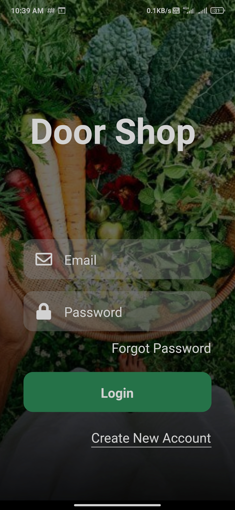
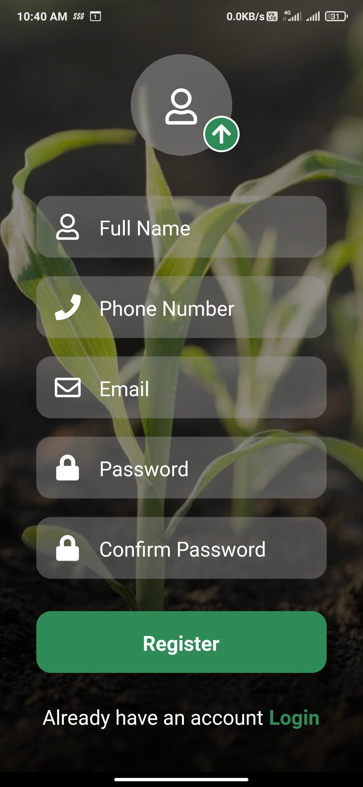

 
 
 
 
 
 
 
 
 
 
 
 
 
 
 
 
 
 
 
 
 
 
 
 
 

Animated typewriting text for the heading in login scrren and a background image in both the screens. Login and Register form, authenticating the user from the firebase and linking the screens to each other. In register form, customer has to select the profile pic also.

 
 

## Home
---
 
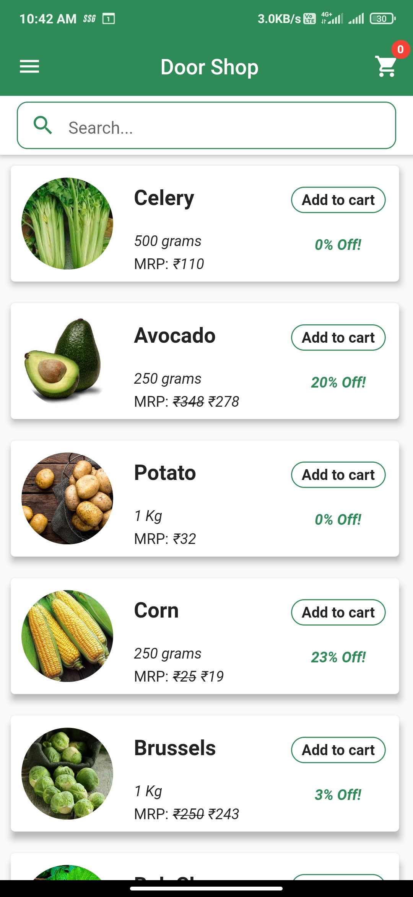
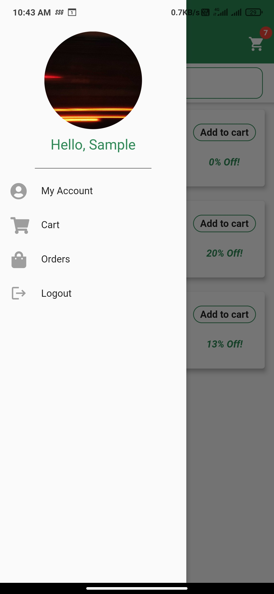

 
 
 
 
 
 
 
 
 
 
 
 
 
 
 
 
 
 
 
 
 
 
 
 
 

Home page, consisting the list of vegetables, search option for faster selection, and side drawer. Once the quantity reaches 0, it's removed from the list as per the check placed. The side drawer contains the presentary, and the links to my account, orders, and cart, additionally logout.

 
 

## Search
---
 

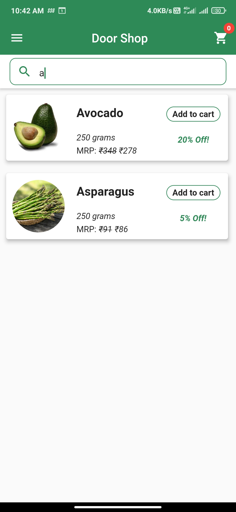

 
 
 
 
 
 
 
 
 
 
 
 
 
 
 
 
 
 
 
 
 
 
 
 
 

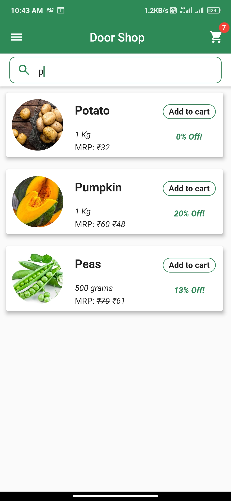
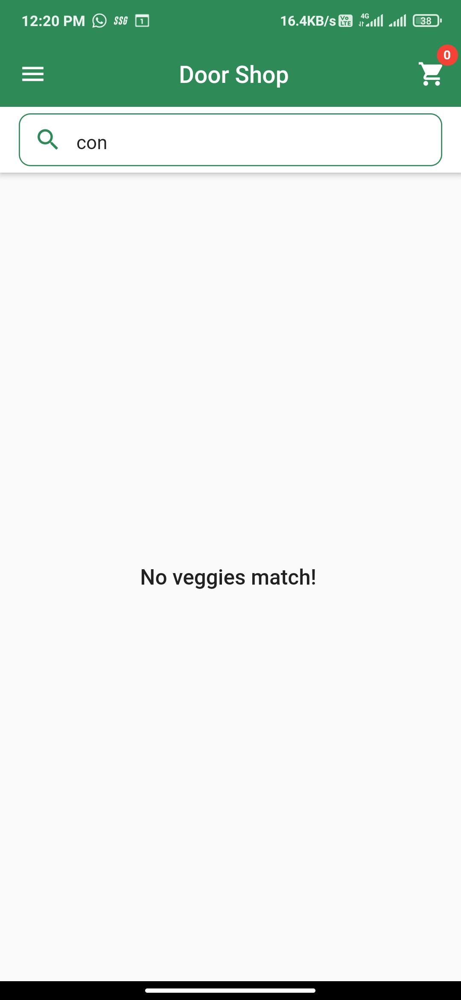

 
 
 
 
 
 
 
 
 
 
 
 
 
 
 
 
 
 
 
 
 
 
 
 
 

Search functionality for finding the exact thing what the cutomer is looking for

 
 

## My Account
---
 
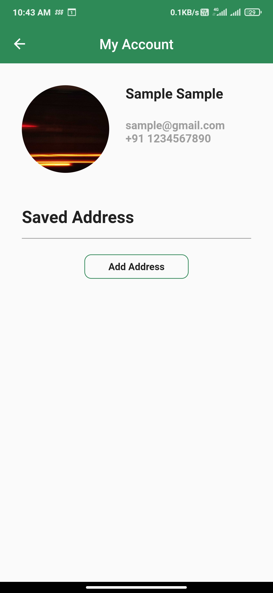
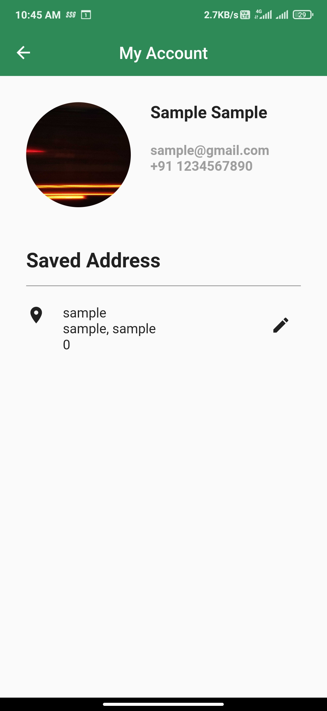

 
 
 
 
 
 
 
 
 
 
 
 
 
 
 
 
 
 
 
 
 
 
 
 
 

My Account contains the customer information, such as name, email, contact number and profile pic. Additionally, this also contains the saved address and the option to edit the address

 
 

## Address Form
---
 
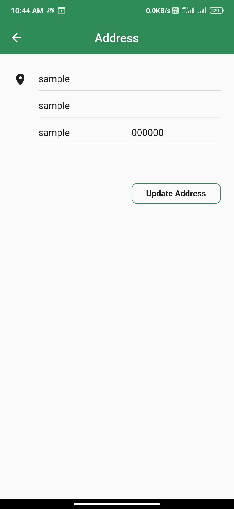

 
 
 
 
 
 
 
 
 
 
 
 
 
 
 
 
 
 
 
 
 
 
 
 
 

Basic page layout to add or update the address and interact with the firebase.

 
 

## Cart
---
 
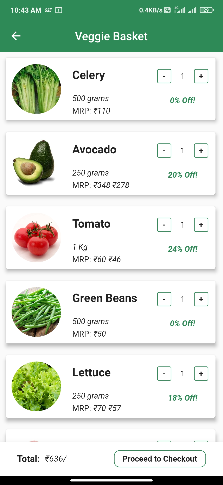
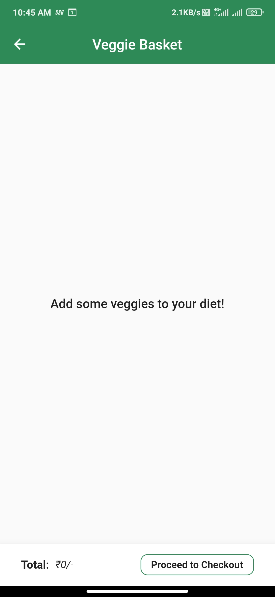

 
 
 
 
 
 
 
 
 
 
 
 
 
 
 
 
 
 
 
 
 
 
 
 
 

The cart number shows the number of distinct products and not the repeats. In the cart section, you can increase/decrease the product quantities. Quantity check is placed while addiding to the cart and the cart is interacting with the firebase to save the cart items on the cloud.

 
 

## Checkout
---
 
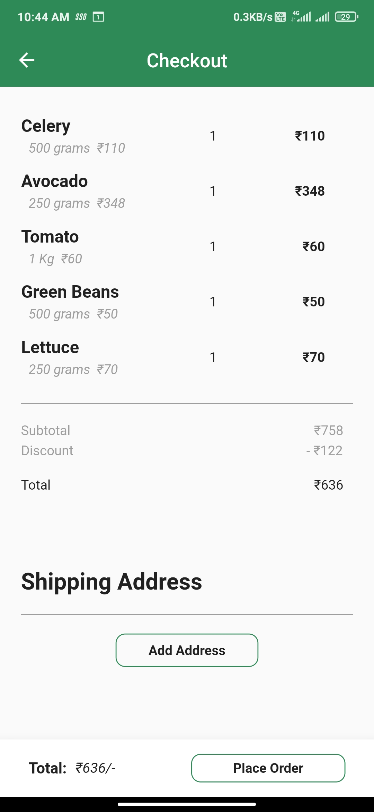
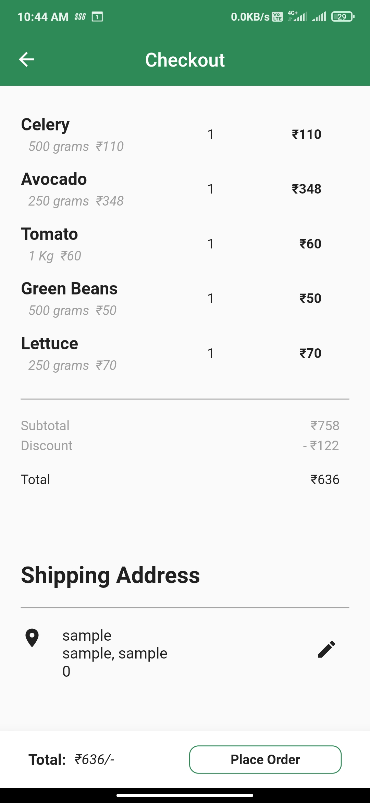

 
 
 
 
 
 
 
 
 
 
 
 
 
 
 
 
 
 
 
 
 
 
 
 
 

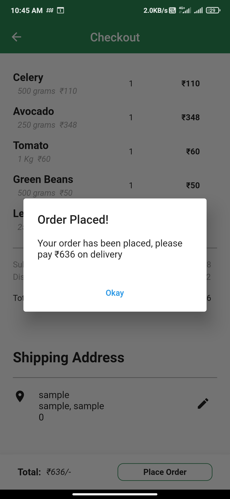

 
 
 
 
 
 
 
 
 
 
 
 
 
 
 
 
 
 
 
 
 
 
 
 
 

This is the checkout page, showing the list of cart items, subtotal, discounts and total price. Adding or updating address option is also provided on the checkout page. The 3rd image shows the message after the order is placed. All the orders are stored on the firebase.

 
 

## Orders
---
 
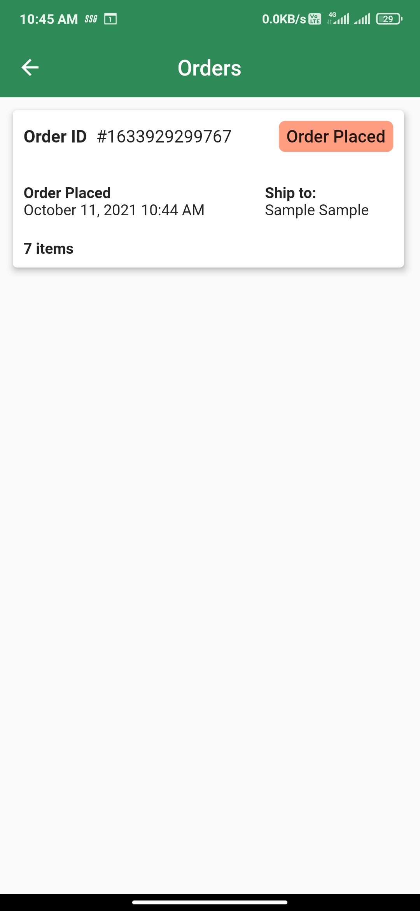
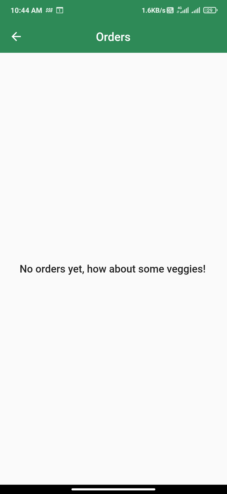

 
 
 
 
 
 
 
 
 
 
 
 
 
 
 
 
 
 
 
 
 
 
 
 
 

The orders page lists all the orders placed by the customer and their status. On tapping the order, you can see the detailed summary of that order

 
 

## Order Summary
---
 
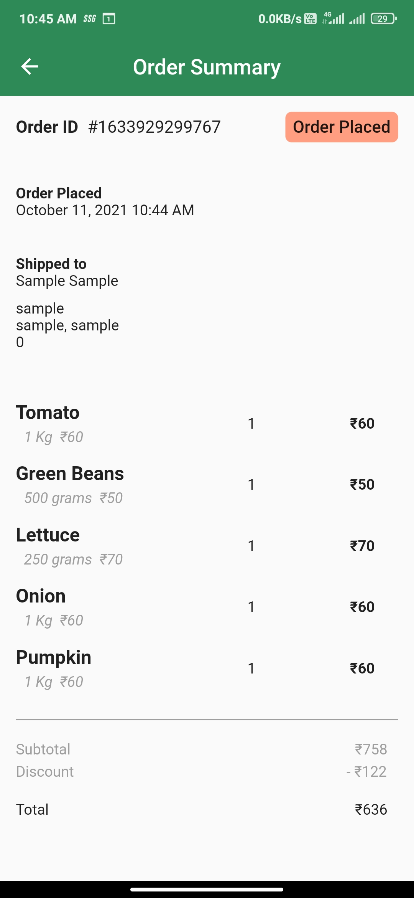
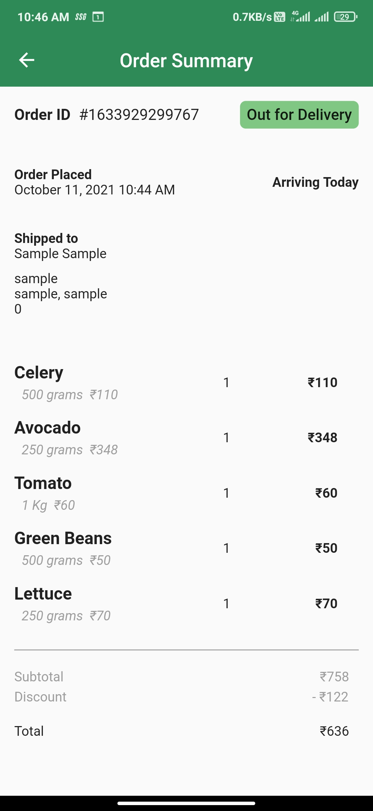

 
 
 
 
 
 
 
 
 
 
 
 
 
 
 
 
 
 
 
 
 
 
 
 
 

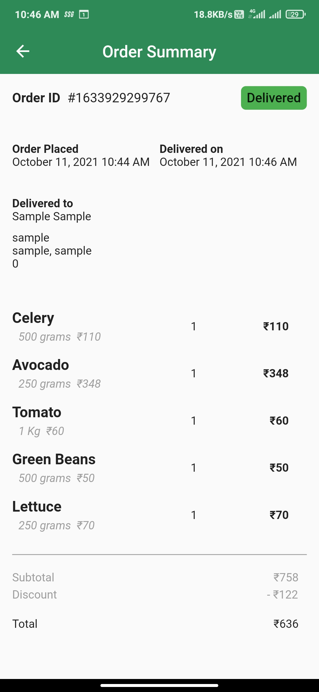

 
 
 
 
 
 
 
 
 
 
 
 
 
 
 
 
 
 
 
 
 
 
 
 
 

The order summary contains the detailed information about that order, cutomer info, order date, odering address, list of items, billing amount, and status. Additionally, out for delivery status shows arriving today message and the delivered status mentions the delivery date.

 
 
